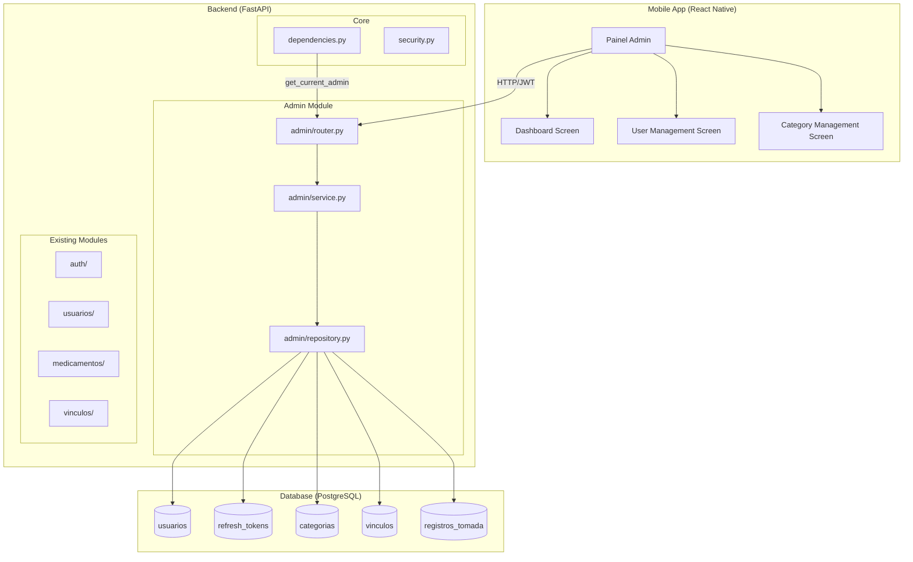
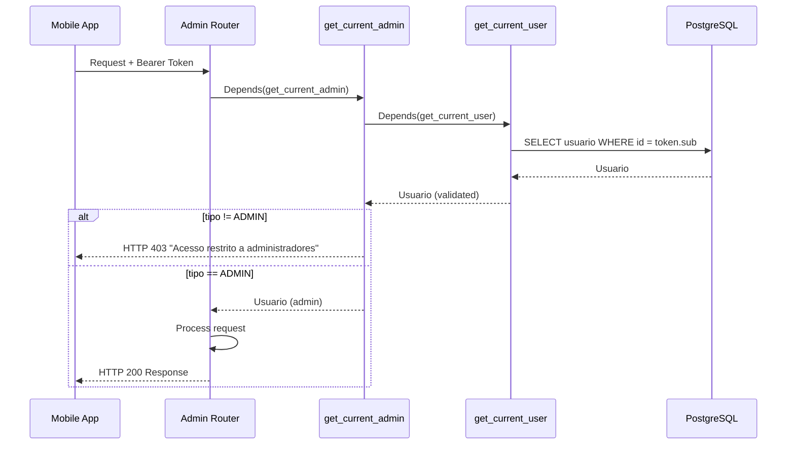
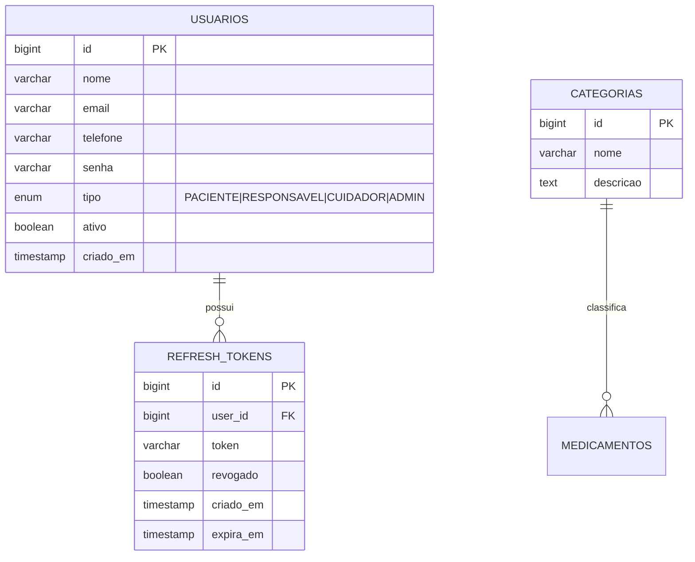

# Design Document: Admin Access Control

## Overview

Esta feature introduz o tipo de usuário ADMIN ao sistema MedAlert, concedendo acesso irrestrito a todos os recursos do sistema. O design segue o padrão modular existente (router → service → repository → model) e adiciona um novo módulo `admin` sob `app/modules/admin/` para centralizar os endpoints administrativos. A autorização é implementada via uma nova dependência FastAPI (`get_current_admin`) que reutiliza `get_current_user` e valida o tipo do usuário. O bypass de vínculo é implementado modificando as funções `_verify_access_to_paciente` existentes para aceitar um parâmetro opcional ou verificar o tipo ADMIN antes de checar vínculos.

### Decisões de Design

1. **Módulo centralizado**: Todos os endpoints exclusivos de admin ficam em `app/modules/admin/` para separação clara de responsabilidades.
2. **Dependência composta**: `get_current_admin` encadeia `get_current_user` → verifica `tipo == ADMIN`, mantendo o fluxo de autenticação existente intacto.
3. **Bypass por tipo**: Em vez de criar rotas duplicadas, as funções de verificação de acesso existentes são modificadas para ignorar a checagem de vínculo quando `current_user.tipo == TipoUsuario.ADMIN`.
4. **Categorias com hard delete**: Conforme requisito 5.3, categorias são removidas fisicamente (não soft delete), pois são dados de referência sem histórico de auditoria.
5. **Métricas sem cache**: Computadas em tempo real via queries agregadas no PostgreSQL para garantir dados sempre atualizados.
6. **Auditoria via logging**: Ações de admin que ignoram controle de acesso são registradas via `logging` com o ID do admin para rastreabilidade.

## Architecture



### Fluxo de Autorização Admin



## Components and Interfaces

### 1. Dependência `get_current_admin`

**Localização**: `app/core/dependencies.py`

```python
async def get_current_admin(
    current_user: Usuario = Depends(get_current_user),
) -> Usuario:
    """Validate that the authenticated user is an ADMIN."""
    if current_user.tipo != TipoUsuario.ADMIN:
        raise HTTPException(
            status_code=status.HTTP_403_FORBIDDEN,
            detail="Acesso restrito a administradores",
        )
    return current_user
```

### 2. Admin Router

**Localização**: `app/modules/admin/router.py`

| Método | Endpoint | Descrição |
|--------|----------|-----------|
| GET | `/api/v1/admin/usuarios` | Lista paginada de usuários (filtros: tipo, busca) |
| GET | `/api/v1/admin/usuarios/{id}` | Detalhes de um usuário |
| PATCH | `/api/v1/admin/usuarios/{id}/ativar` | Ativa um usuário |
| PATCH | `/api/v1/admin/usuarios/{id}/desativar` | Desativa um usuário |
| PATCH | `/api/v1/admin/usuarios/{id}/tipo` | Altera o tipo de um usuário |
| POST | `/api/v1/admin/usuarios/{id}/forcar-logout` | Revoga todos os refresh tokens |
| GET | `/api/v1/admin/metricas` | Métricas agregadas do sistema |
| POST | `/api/v1/admin/categorias` | Cria uma categoria |
| PUT | `/api/v1/admin/categorias/{id}` | Atualiza uma categoria |
| DELETE | `/api/v1/admin/categorias/{id}` | Exclui uma categoria |

### 3. Admin Service

**Localização**: `app/modules/admin/service.py`

```python
class AdminService:
    # Gerenciamento de Usuários
    async def listar_usuarios(db, page, size, tipo_filtro, busca) -> PaginatedResponse
    async def obter_usuario(db, usuario_id) -> Usuario
    async def ativar_usuario(db, usuario_id, admin_id) -> Usuario
    async def desativar_usuario(db, usuario_id, admin_id) -> Usuario
    async def alterar_tipo_usuario(db, usuario_id, novo_tipo, admin_id) -> Usuario

    # Categorias
    async def criar_categoria(db, data) -> Categoria
    async def atualizar_categoria(db, categoria_id, data) -> Categoria
    async def excluir_categoria(db, categoria_id) -> None

    # Métricas
    async def obter_metricas(db) -> MetricasResponse

    # Token Revocation
    async def forcar_logout(db, usuario_id, admin_id) -> int
```

### 4. Admin Repository

**Localização**: `app/modules/admin/repository.py`

```python
# Queries de usuários
async def listar_todos_usuarios(db, page, size, tipo, busca) -> tuple[list[Usuario], int]
async def obter_usuario_por_id(db, usuario_id) -> Usuario | None
async def atualizar_status_usuario(db, usuario, ativo) -> Usuario
async def atualizar_tipo_usuario(db, usuario, novo_tipo) -> Usuario

# Queries de categorias
async def criar_categoria(db, nome, descricao) -> Categoria
async def atualizar_categoria(db, categoria, nome, descricao) -> Categoria
async def excluir_categoria(db, categoria) -> None
async def categoria_possui_medicamentos(db, categoria_id) -> bool
async def categoria_existe_por_nome(db, nome) -> bool

# Queries de métricas
async def contar_usuarios_por_tipo(db) -> dict[str, int]
async def contar_usuarios_ativos(db) -> int
async def contar_vinculos_ativos(db) -> int
async def calcular_taxa_adesao(db, dias=30) -> float
async def contar_registros_problematicos(db, dias=30) -> dict[str, int]

# Queries de tokens
async def revogar_tokens_usuario(db, usuario_id) -> int
```

### 5. Modificação do Bypass de Vínculo

**Localização**: `app/modules/medicamentos/service.py` (e módulos similares)

```python
async def _verify_access_to_paciente(
    current_user: Usuario, paciente_id: int, db: AsyncSession
) -> None:
    # Admin bypasses all vinculo checks
    if current_user.tipo == TipoUsuario.ADMIN:
        logger.info(f"Admin {current_user.id} acessando dados do paciente {paciente_id}")
        return

    # Existing logic unchanged for non-admin users
    if current_user.id == paciente_id:
        return
    has_vinculo = await has_active_vinculo(current_user.id, paciente_id, db)
    if not has_vinculo:
        raise HTTPException(status_code=403, detail="Acesso negado")
```

### 6. Modificação do Registro de Usuários

**Localização**: `app/modules/usuarios/service.py`

```python
async def create_user(user_data: UsuarioCreate, db: AsyncSession) -> Usuario:
    # Block ADMIN creation via API
    if user_data.tipo == TipoUsuario.ADMIN:
        raise HTTPException(
            status_code=status.HTTP_403_FORBIDDEN,
            detail="Não é permitido criar usuários ADMIN via API",
        )
    # ... existing logic
```

## Data Models

### Alteração no Enum TipoUsuario

```python
class TipoUsuario(str, enum.Enum):
    PACIENTE = "PACIENTE"
    RESPONSAVEL = "RESPONSAVEL"
    CUIDADOR = "CUIDADOR"
    ADMIN = "ADMIN"  # Novo valor
```

**Migração Alembic**: Adicionar `ADMIN` ao enum PostgreSQL existente via `ALTER TYPE tipousuario ADD VALUE 'ADMIN'`.

### Schemas do Módulo Admin

```python
# app/modules/admin/schemas.py

class UsuarioAdminResponse(BaseModel):
    id: int
    nome: str
    email: str
    tipo: TipoUsuario
    ativo: bool
    criado_em: datetime

class UsuarioDetalheAdminResponse(BaseModel):
    id: int
    nome: str
    email: str
    telefone: str | None
    tipo: TipoUsuario
    ativo: bool
    criado_em: datetime
    # Campos de PACIENTE
    data_nascimento: date | None
    obs_medicas: str | None
    nivel_autonomia: NivelAutonomia | None
    # Campos de RESPONSAVEL/CUIDADOR
    grau_parentesco: str | None
    recebe_notificacoes: bool | None

class PaginatedUsuariosResponse(BaseModel):
    items: list[UsuarioAdminResponse]
    total: int
    page: int
    size: int

class AlterarTipoRequest(BaseModel):
    novo_tipo: TipoUsuario

class CategoriaCreateRequest(BaseModel):
    nome: str = Field(max_length=100)
    descricao: str | None = None

class CategoriaUpdateRequest(BaseModel):
    nome: str | None = Field(default=None, max_length=100)
    descricao: str | None = None

class MetricasResponse(BaseModel):
    usuarios_por_tipo: dict[str, int]
    usuarios_ativos: int
    vinculos_ativos: int
    taxa_adesao_30d: float  # Percentual 0-100
    registros_atrasados_30d: int
    registros_ignorados_30d: int

class ForcarLogoutResponse(BaseModel):
    tokens_revogados: int
```

### Diagrama ER (Impacto)



## Correctness Properties

*A property is a characteristic or behavior that should hold true across all valid executions of a system — essentially, a formal statement about what the system should do. Properties serve as the bridge between human-readable specifications and machine-verifiable correctness guarantees.*

### Property 1: Admin registration rejection

*For any* user registration payload with `tipo = ADMIN`, the system SHALL reject the request with HTTP 403, regardless of the other fields in the payload.

**Validates: Requirements 1.4**

### Property 2: Admin dependency authorization

*For any* authenticated user with `tipo != ADMIN` (PACIENTE, RESPONSAVEL, or CUIDADOR), the `get_current_admin` dependency SHALL raise HTTP 403 with detail "Acesso restrito a administradores". Conversely, for any user with `tipo == ADMIN`, the dependency SHALL return the user successfully.

**Validates: Requirements 2.1, 2.2**

### Property 3: User listing filter correctness

*For any* set of users in the database and any combination of tipo filter and search query, the admin user listing endpoint SHALL return exactly those users whose tipo matches the filter (if provided) AND whose nome or email contains the search string case-insensitively (if provided).

**Validates: Requirements 3.2, 3.3**

### Property 4: User activation toggle

*For any* user (not the admin themselves), toggling their `ativo` status via the admin endpoint SHALL result in the user's `ativo` field being set to the target value (TRUE for activate, FALSE for deactivate).

**Validates: Requirements 3.5, 3.6**

### Property 5: Admin vinculo bypass

*For any* admin user and any paciente in the system, the admin SHALL be able to access the paciente's data (medicamentos, agendas, registros_tomada) without requiring an active vínculo between them.

**Validates: Requirements 4.1, 4.2, 4.3, 4.4, 8.1**

### Property 6: Non-admin vinculo enforcement

*For any* non-admin user (PACIENTE, RESPONSAVEL, CUIDADOR) attempting to access another paciente's data, the system SHALL deny access with HTTP 403 when no active vínculo exists between them.

**Validates: Requirements 4.5**

### Property 7: Category name uniqueness

*For any* category name that already exists in the database, attempting to create a new category with the same name SHALL be rejected with HTTP 409.

**Validates: Requirements 5.5**

### Property 8: Category deletion constraint

*For any* category that has associated medicamentos, attempting to delete it SHALL be rejected with HTTP 409. For any category with zero associated medicamentos, deletion SHALL succeed and the category SHALL no longer exist in the database.

**Validates: Requirements 5.3, 5.4**

### Property 9: Metrics computation correctness

*For any* database state, the metrics endpoint SHALL return: (a) user counts per tipo that match `COUNT(*) GROUP BY tipo`, (b) active user count matching `COUNT(*) WHERE ativo = TRUE`, (c) active vinculos count matching `COUNT(*) WHERE ativo = TRUE`, and (d) adherence rate equal to `COUNT(CONFIRMADO) / COUNT(*) * 100` for registros in the last 30 days.

**Validates: Requirements 6.1, 6.2, 6.3, 6.4, 6.5**

### Property 10: Token revocation completeness

*For any* user with N active (non-revoked, non-expired) refresh tokens, forcing logout via the admin endpoint SHALL set `revogado = TRUE` on all N tokens and return a response with `tokens_revogados = N`.

**Validates: Requirements 7.1, 7.2**

### Property 11: Revoked token rejection

*For any* refresh token that has been revoked (`revogado = TRUE`), attempting to use it for session renewal SHALL result in HTTP 401.

**Validates: Requirements 7.4**

## Error Handling

| Cenário | HTTP Status | Detail |
|---------|-------------|--------|
| Token ausente ou inválido | 401 | "Token inválido" |
| Usuário não é ADMIN | 403 | "Acesso restrito a administradores" |
| Admin tenta desativar a si mesmo | 400 | "Admin não pode desativar a própria conta" |
| Admin tenta alterar próprio tipo | 400 | "Admin não pode alterar o próprio tipo" |
| Admin tenta revogar próprios tokens | 400 | "Admin não pode revogar os próprios tokens" |
| Registro de ADMIN via API | 403 | "Não é permitido criar usuários ADMIN via API" |
| Categoria duplicada | 409 | "Categoria já existe" |
| Categoria com medicamentos associados | 409 | "Categoria possui medicamentos associados" |
| Usuário não encontrado | 404 | "Usuário não encontrado" |
| Categoria não encontrada | 404 | "Categoria não encontrada" |
| Não-admin acessa endpoint de gerenciamento de categorias | 403 | "Acesso restrito a administradores" |

### Estratégia de Erros

- Todos os erros seguem o padrão existente `{"detail": "mensagem"}`.
- Erros de validação (Pydantic) retornam 422 automaticamente via FastAPI.
- Erros inesperados são capturados pelo handler global e retornam 500 com log detalhado.
- Self-protection checks (admin não pode agir sobre si mesmo) são validados na camada de service antes de qualquer operação no banco.

## Testing Strategy

### Abordagem Dual

A estratégia de testes combina:

1. **Testes unitários (pytest)**: Cobrem exemplos específicos, edge cases e condições de erro.
2. **Testes de propriedade (Hypothesis)**: Verificam propriedades universais com inputs gerados aleatoriamente.

### Biblioteca de Property-Based Testing

- **Biblioteca**: [Hypothesis](https://hypothesis.readthedocs.io/) para Python
- **Configuração**: Mínimo de 100 iterações por teste de propriedade (`@settings(max_examples=100)`)
- **Tag**: Cada teste de propriedade deve conter um comentário referenciando a propriedade do design:
  ```python
  # Feature: admin-access-control, Property 1: Admin registration rejection
  ```

### Testes Unitários (Exemplos e Edge Cases)

| Teste | Tipo | Valida |
|-------|------|--------|
| Admin login retorna JWT com claim tipo | Example | Req 1.2 |
| Requisição sem token retorna 401 | Example | Req 2.3 |
| Admin desativar a si mesmo retorna 400 | Edge Case | Req 3.8 |
| Admin alterar próprio tipo retorna 400 | Edge Case | Req 3.9 |
| Forçar logout de usuário sem tokens retorna count=0 | Edge Case | Req 7.3 |
| Admin forçar logout de si mesmo retorna 400 | Edge Case | Req 7.5 |
| Admin cria vínculo entre dois usuários | Example | Req 8.2 |
| Admin confirma registro de tomada sem vínculo | Example | Req 8.3 |

### Testes de Propriedade

| Property | Estratégia de Geração |
|----------|----------------------|
| P1: Admin registration rejection | Gerar payloads válidos de registro com tipo=ADMIN, variar nome/email/senha |
| P2: Admin dependency authorization | Gerar usuários com tipos aleatórios, verificar resultado da dependência |
| P3: User listing filter correctness | Gerar conjuntos de usuários com tipos/nomes variados, aplicar filtros |
| P4: User activation toggle | Gerar usuários com ativo aleatório, aplicar toggle, verificar resultado |
| P5: Admin vinculo bypass | Gerar pacientes sem vínculo com admin, verificar acesso concedido |
| P6: Non-admin vinculo enforcement | Gerar não-admins sem vínculo, verificar acesso negado |
| P7: Category name uniqueness | Gerar nomes de categorias, criar duplicatas, verificar rejeição |
| P8: Category deletion constraint | Gerar categorias com/sem medicamentos, verificar comportamento de exclusão |
| P9: Metrics computation correctness | Gerar estados de banco variados, verificar cálculos de métricas |
| P10: Token revocation completeness | Gerar usuários com N tokens ativos, revogar, verificar contagem |
| P11: Revoked token rejection | Revogar tokens, tentar refresh, verificar rejeição |

### Testes de Integração

| Teste | Descrição |
|-------|-----------|
| Fluxo completo de login admin | Login → acesso a endpoint admin → operação |
| Auditoria de bypass | Admin acessa dados sem vínculo → log contém admin_id |
| Migração Alembic | Verificar que ADMIN é adicionado ao enum sem perda de dados |

### Estrutura de Arquivos de Teste

```
backend/tests/
├── test_admin/
│   ├── test_admin_dependency.py
│   ├── test_admin_usuarios.py
│   ├── test_admin_categorias.py
│   ├── test_admin_metricas.py
│   ├── test_admin_forcar_logout.py
│   ├── test_admin_bypass_vinculo.py
│   └── properties/
│       ├── test_prop_registration.py
│       ├── test_prop_authorization.py
│       ├── test_prop_user_listing.py
│       ├── test_prop_activation.py
│       ├── test_prop_bypass.py
│       ├── test_prop_categories.py
│       ├── test_prop_metrics.py
│       └── test_prop_tokens.py
```
